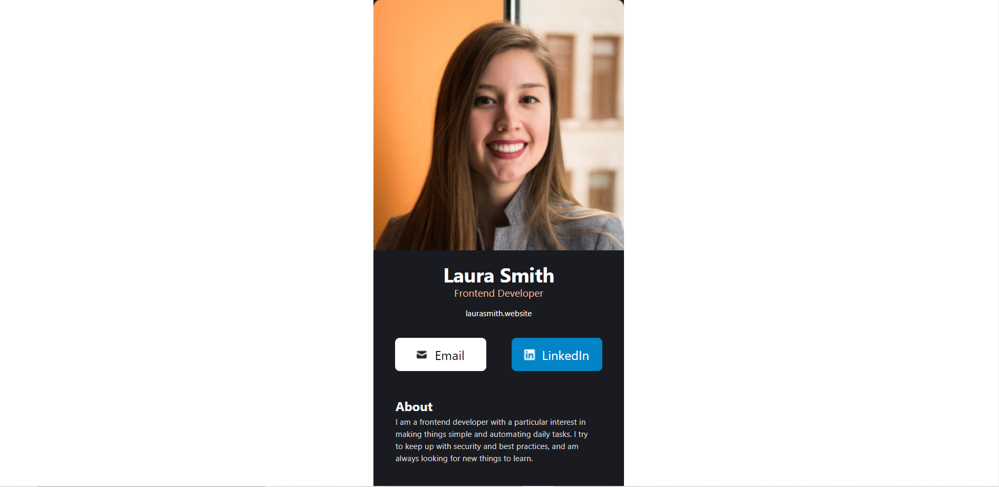

# Business Card

#### Please note that the Github pages link does not currently work. Instead, please click on the links section in the table of contents down below to see the live link for this project.


## Table of contents

- [Overview](#overview)
  - [Screenshots](#screenshots)
  - [Links](#links)
- [My process](#my-process)
  - [Built with](#built-with)
  - [What I learned](#what-i-learned)
  - [Continued development](#continued-development)

## Overview

This project is from Scrimba's Frontend Path course. It is a simple React component showcasing a virtual business card.

**This is NOT a tutorial project.** I built this utilizing the skills I acquired from the course as well as my own knowledge. There is no official solution.

### Screenshots

##### Desktop View



**There was not an optimized view for mobile devices in the Figma design file.**


### Links

- Solution URL: [Github Repo](https://github.com/DeviantSchemist/businesscard)
- Live Site URL: [Live Site](https://quiet-frangollo-09104f.netlify.app/)

## My process

### Built with

- Semantic HTML5 markup
- React JS
- Vite
- Tailwind CSS
- Flexbox

### What I learned

I built this component using React and Tailwind CSS, using Vite as the bootstrap. This was my first experience on the Scrimba course creating a React component, and using a modern bootstrapper such as Vite.

I used semantic markup in each of the component files in order to get familiar with building sites with accessibility in mind.

I solidified my existing knowledge of certain React concepts, such as importing images to use in img tags instead of using a file path, and using the @import-normalize directive to import a CSS Reset into my project instead of using another source.

Using Tailwind CSS helped me get accustomed to an industry framework that many companies use to enable faster development.

**See below for the Footer Component**:

```JSX
import Twitter from "../assets/twitter.png";
import Facebook from "../assets/facebook.png";
import Instagram from "../assets/instagram.png";
import Github from "../assets/github.png";

export default function Footer() {
  return (
    <footer className="bg-[#161619] flex justify-center gap-x-8 py-5">
      
      
      
      
    </footer>
  )
}
```